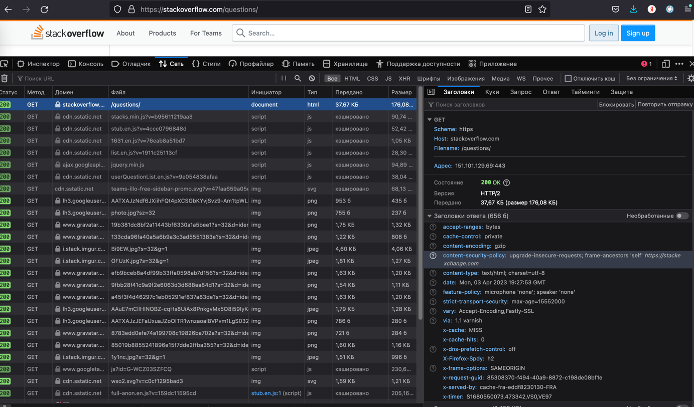
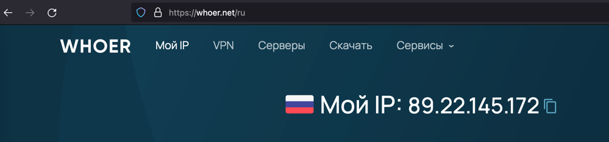
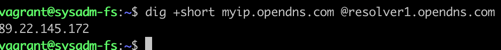
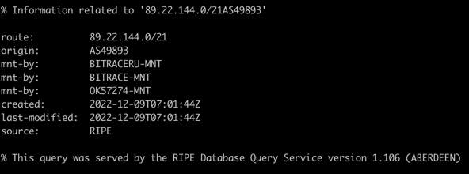
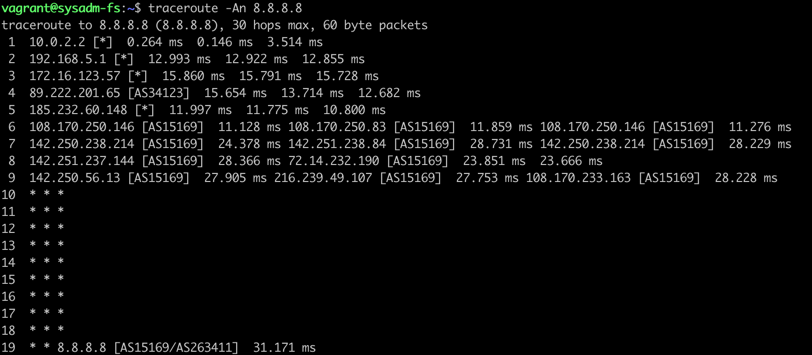
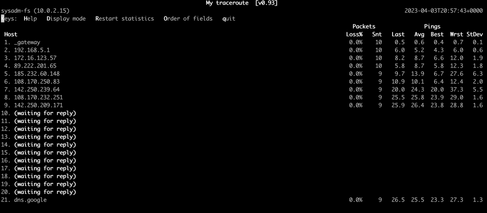
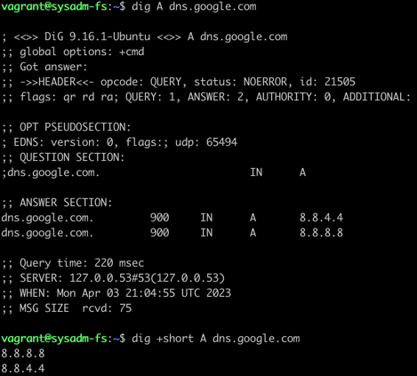
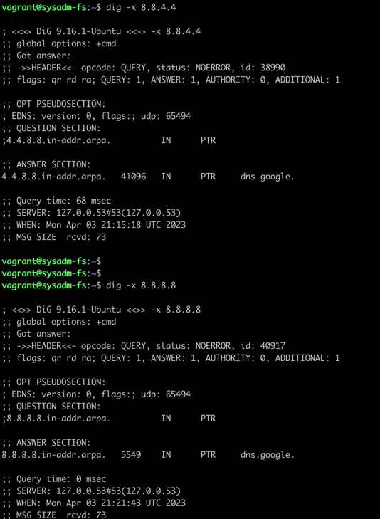

## Task 1
```
vagrant@sysadm-fs:~$ telnet stackoverflow.com 80
Trying 151.101.129.69...
Connected to stackoverflow.com.
Escape character is '^]'.

GET /questions HTTP/1.0
HOST: stackoverflow.com

HTTP/1.1 403 Forbidden
Connection: close
Content-Length: 1920
Server: Varnish
Retry-After: 0
Content-Type: text/html
Accept-Ranges: bytes
Date: Mon, 03 Apr 2023 19:18:43 GMT
Via: 1.1 varnish
X-Served-By: cache-fra-eddf8230039-FRA
X-Cache: MISS
X-Cache-Hits: 0
X-Timer: S1680549523.414391,VS0,VE1
X-DNS-Prefetch-Control: off

<!DOCTYPE html>
<html>
<head>
    <meta http-equiv="Content-Type" content="text/html; charset=UTF-8" />
    <title>Forbidden - Stack Exchange</title>
    <style type="text/css">
		body
		{
			color: #333;
			font-family: 'Helvetica Neue', Arial, sans-serif;
			font-size: 14px;
			background: #fff url('img/bg-noise.png') repeat left top;
			line-height: 1.4;
		}
		h1
		{
			font-size: 170%;
			line-height: 34px;
			font-weight: normal;
		}
		a { color: #366fb3; }
		a:visited { color: #12457c; }
		.wrapper {
			width:960px;
			margin: 100px auto;
			text-align:left;
		}
		.msg {
			float: left;
			width: 700px;
			padding-top: 18px;
			margin-left: 18px;
		}
    </style>
</head>
<body>
    <div class="wrapper">
		<div style="float: left;">
			
		</div>
		<div class="msg">
			<h1>Access Denied</h1>
                        <p>This IP address (89.22.145.172) has been blocked from access to our services. If you believe this to be in error, please contact us at <a href="mailto:team@stackexchange.com?Subject=Blocked%2089.22.145.172%20(Request%20ID%3A%203204450432-FRA)">team@stackexchange.com</a>.</p>
                        <p>When contacting us, please include the following information in the email:</p>
                        <p>Method: block</p>
                        <p>XID: 3204450432-FRA</p>
                        <p>IP: 89.22.145.172</p>
                        <p>X-Forwarded-For: </p>
                        <p>User-Agent: </p>

                        <p>Time: Mon, 03 Apr 2023 19:18:43 GMT</p>
                        <p>URL: stackoverflow.com/questions</p>
                        <p>Browser Location: <span id="jslocation">(not loaded)</span></p>
		</div>
	</div>
	<script>document.getElementById('jslocation').innerHTML = window.location.href;</script>
</body>
</html>Connection closed by foreign host.
```
Получил ответ 403 Forbidden - доступ к странице запрещен

## Task 2
ответ 200ОК


## Task 3




## Task 4


## Task 5


## Task 6

наибольшая задержка(по среднему  значению) у 9 хоста

## Task 7


## Task 8

