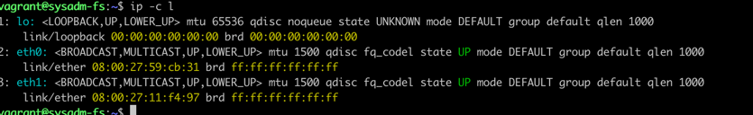
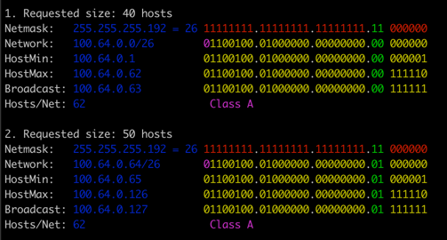

## Task 1

также можно использовать ifconfig (Linux) или ipconfig(Windows)
есть утилита nmtui для настройки через NetworkManager

## Task 2
протокол LLDP в пакете lldpd

## Task 3
VLAN в пакете vlan
```
##vlan с ID-100 для интерфейса eth0 with ID - 100 в Debian/Ubuntu Linux##
auto eth0.100
iface eth0.100 inet static
address 192.168.1.200
netmask 255.255.255.0
vlan-raw-device eth0
```

## Task 4
```
Типы агрегации (объединения) интерфейсов в Linux
mode=0 (balance-rr)

Этот режим используется по-умолчанию, если в настройках не указано другое. balance-rr обеспечивает балансировку нагрузки и отказоустойчивость. В данном режиме пакеты отправляются "по кругу" от первого интерфейса к последнему и сначала. Если выходит из строя один из интерфейсов, пакеты отправляются на остальные оставшиеся.При подключении портов к разным коммутаторам, требует их настройки.
mode=1 (active-backup)

При active-backup один интерфейс работает в активном режиме, остальные в ожидающем. Если активный падает, управление передается одному из ожидающих. Не требует поддержки данной функциональности от коммутатора.
mode=2 (balance-xor)

Передача пакетов распределяется между объединенными интерфейсами по формуле ((MAC-адрес источника) XOR (MAC-адрес получателя)) % число интерфейсов. Один и тот же интерфейс работает с определённым получателем. Режим даёт балансировку нагрузки и отказоустойчивость.
mode=3 (broadcast)

Происходит передача во все объединенные интерфейсы, обеспечивая отказоустойчивость.
mode=4 (802.3ad)

Это динамическое объединение портов. В данном режиме можно получить значительное увеличение пропускной способности как входящего так и исходящего трафика, используя все объединенные интерфейсы. Требует поддержки режима от коммутатора, а так же (иногда) дополнительную настройку коммутатора.
mode=5 (balance-tlb)

Адаптивная балансировка нагрузки. При balance-tlb входящий трафик получается только активным интерфейсом, исходящий - распределяется в зависимости от текущей загрузки каждого интерфейса. Обеспечивается отказоустойчивость и распределение нагрузки исходящего трафика. Не требует специальной поддержки коммутатора.
mode=6 (balance-alb)

Адаптивная балансировка нагрузки (более совершенная). Обеспечивает балансировку нагрузки как исходящего (TLB, transmit load balancing), так и входящего трафика (для IPv4 через ARP). Не требует специальной поддержки коммутатором, но требует возможности изменять MAC-адрес устройства.

Для корректной работы объединения интерфейсов необходимо установить пакет ifenslave-2.6 и проверить наличие модуля bonding.
Для настройки объединения интерфейсов необходимо отредактировать файл конфигурации сети до следующего вида:

root@bond-srv:~# cat /etc/network/interfaces
# The loopback network interface
auto lo
iface lo inet loopback

# The primary network interface
auto bond0 eth0 eth1
# настроим параметры бонд-интерфейса
iface bond0 inet static
        address 10.0.0.11
        netmask 255.255.255.0
        gateway 10.0.0.254
        # определяем подчиненные (объединяемые) интерфейсы
        bond-slaves eth0 eth1
        # задаем тип бондинга
        bond-mode balance-alb
        # интервал проверки линии в миллисекундах
bond-miimon 100
        # Задержка перед установкой соединения в миллисекундах
bond-downdelay 200
# Задержка перед обрывом соединения в миллисекундах
        bond-updelay 200
```

## Task 5
в сети /29 будет 2^(32-29)=8 адресов(6 хостов).
в сети /24 будет 32 сети /29 (256/8=32)
примеры 10.10.10.0/29 10.10.10.8/29 10.10.10.16/29

## Tasks 6


## Task 7
проверка arp таблицы ```arp -a```  
в Linux также можно использовать ```ip neigh```  
для удаления использовать ```arp -d ip``` (* удалить все)
