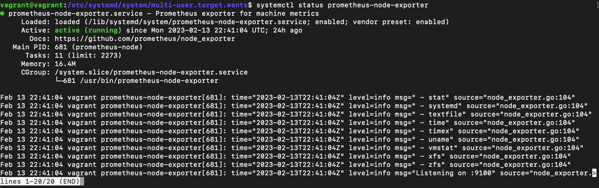
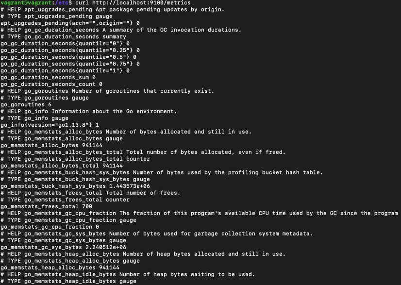
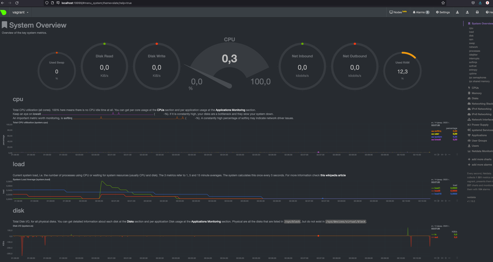
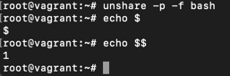
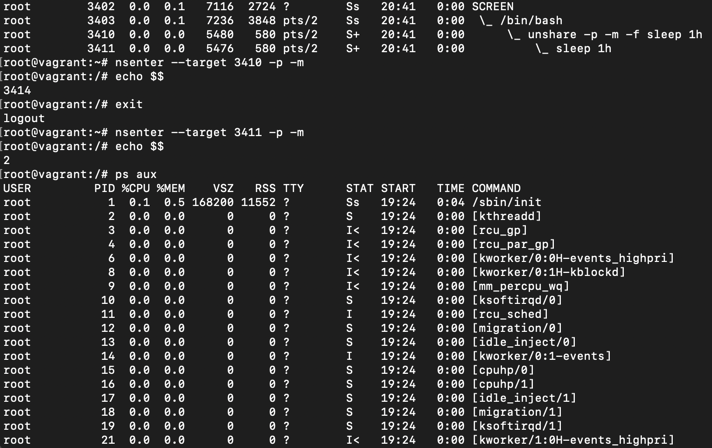
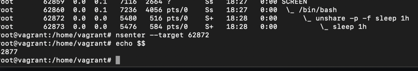
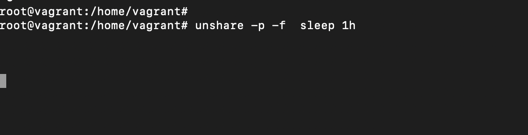
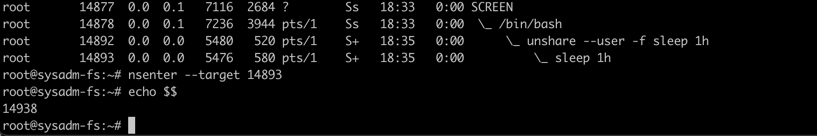

## Task 1
```
[Unit]
Description=Prometheus exporter for machine metrics
Documentation=https://github.com/prometheus/node_exporter

[Service]
Restart=always
User=prometheus
EnvironmentFile=/etc/default/prometheus-node-exporter
ExecStart=/usr/bin/prometheus-node-exporter $ARGS
ExecReload=/bin/kill -HUP $MAINPID
TimeoutStopSec=20s
SendSIGKILL=no

[Install]
WantedBy=multi-user.target
```


## Task 2

```commandline
metrics:
node_cpu_seconds_total 
node_filesystem_avail_bytes
node_network_receive_bytes_total
node_memory_MemAvailable_bytes или node_memory_MemFree_bytes
```
## Task 3



## Task 4
dmesg выдал:
```
[    0.000000] DMI: innotek GmbH VirtualBox/VirtualBox, BIOS VirtualBox 12/01/2006
[    0.000000] Hypervisor detected: KVM
```
видимо понимает, что в виртуальной среде

## Task 5
```
vagrant@vagrant:~$ sysctl fs.nr_open
fs.nr_open = 1048576 - максимальное количество файловых дескрипторов в системе

vagrant@vagrant:~$ ulimit -n
1024 - the maximum number of open file descriptors
```

## Task 6
  
вот в таком варианте показывает PID 1

  
а в таком совсем не то, что на вебинаре или в презентации  
в общем какая то нестыковка
#### Update 1

Когда переношу sleep - то никак не получаю PID 1, я непонимаю как получить результат нужный.  
При запуска unshare консоль засыпает:

Если переносить bash - то тут все корректно показывает.

#### Update 2

при попытке входа в сам процесс sleep - никуда не входит вообще

## Task 7
```
:(){ :|:& };: - Bash fork() Bomb
проверка на ограничения процессов в системе, описанных в limits.conf
[87534.200780] cgroup: fork rejected by pids controller in /user.slice/user-1000.slice/session-3.scope
pids controller судя по всему помог остановить безудержное размножение этой функции
```