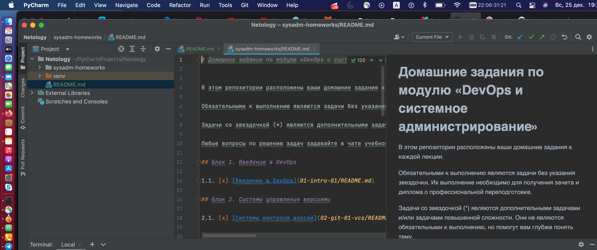
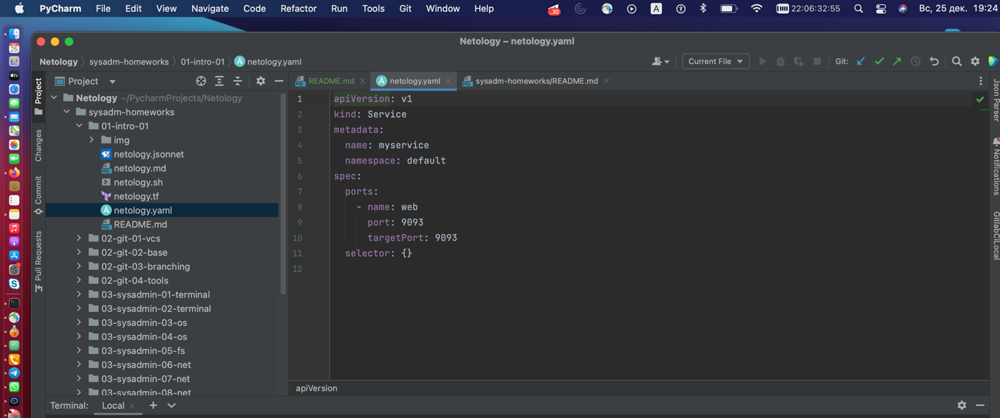
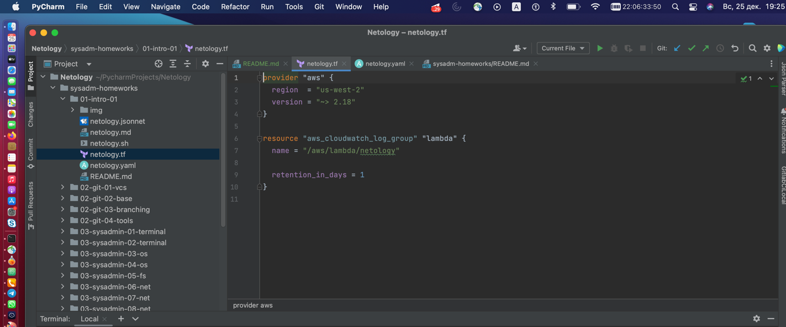
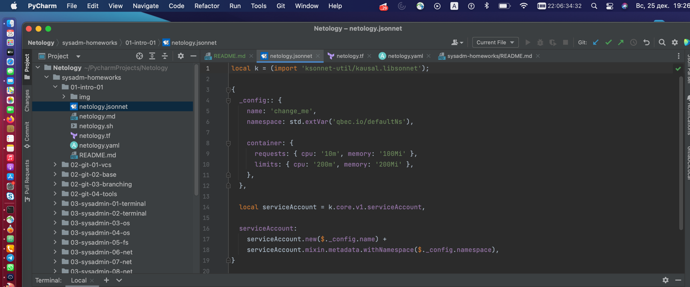

# View IDE Visual Window
# Commit after add new branch 'fix'  
# Мой первый файл MD

проверка изменения файла (First commit)

Файлы, исключенные из commit:
1. Все файлы в папках .terraform в любой возможной директории
2. *.tfstate; *.tfstate.* - все файлы с  расширением tfstate,  а также содержащие .tfstate. в имени
3. crash.log; crash.*.log - файлы crash.log, а также с расширением log и начинающихся на crash.
4. *.tfvars; *.tfvars.json
5. override.tf; override.tf.json; *_override.tf; *_override.tf.json
6. .terraformrc; terraform.rc

## MD

## YAML

## Terraform

## JSON

