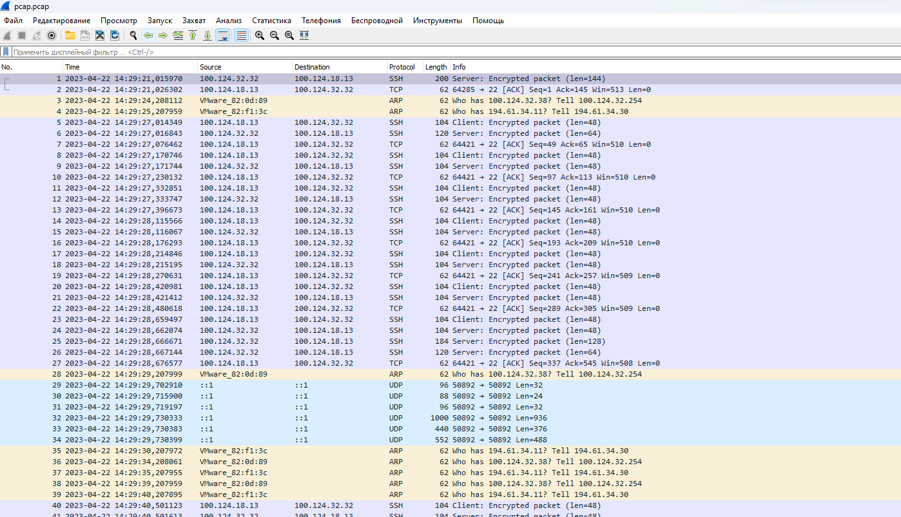

## Task 1-2

```
Bitwarden установлен, двухфакторная идентификация включена
```
## Task 3


ssl включил, сертификат установлен  


## Task 4


## Task 5
публичный ключ на сервере  


сделал нового пользователя для теста, подключение происходит без пароля


## Task 6
  
первая попытка без ключа - просит пароль(потому что от рута пытаюсь подключаться, а ключ у пользователя testuser)  
вторая попытка с подстановкой ключа с нестандартным именем - все норм  

## Task 7



## Task 8


## Task 9
  
мне дополнительно еще нужны порты для sip и 8080