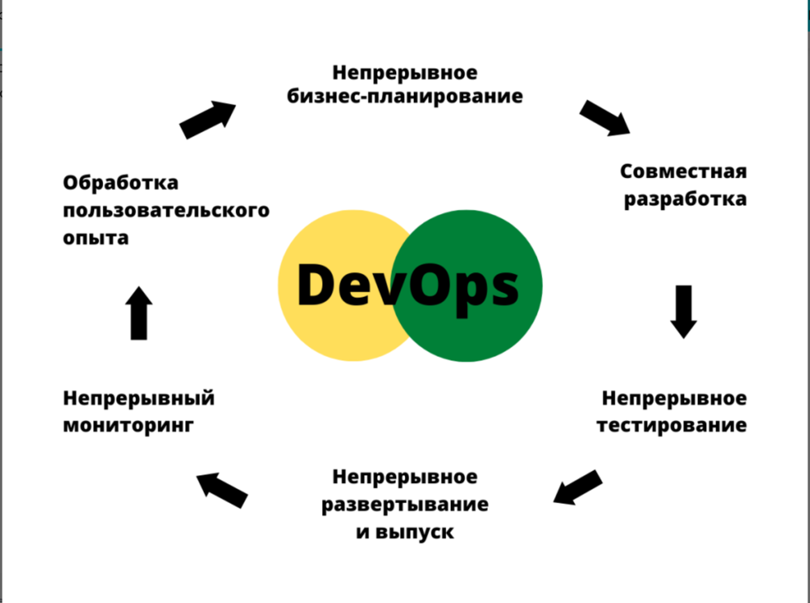

# Задание 2
Жизненный цикл, на мой взгляд, описан на схеме:

1. Получение ТЗ
2. Разработка ПО
3. Тестирование ПО
4. Релиз
5. Получение фидбека
6. Далее по кругу с п.2, если есть замечания, либо финиш, если все ОК