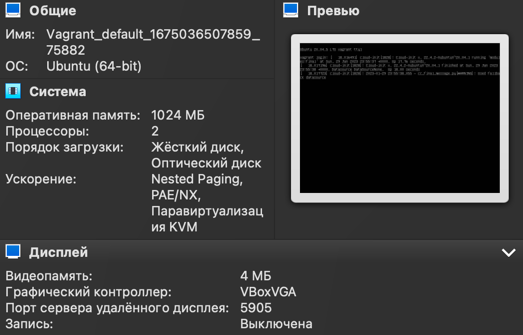
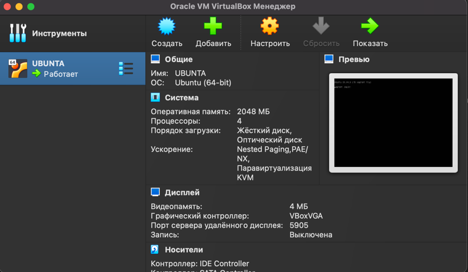

## Task 2

## Task 3
### Добавление ресурсов
Vagrant.configure("2") do |config|  
    config.vm.box = "bento-ubuntu-20.04"  
    config.vm.provider "virtualbox" do |v|  
        v.name = "UBUNTA"  
        v.memory = 2048  
        v.cpus = 4  
    end  
end

## Task 4

## Task 5
### О директиве ignoreboth
Директива объединяет в себе две директивы - igonrespace & ignoredups.  
HISTCONTROL  
 A colon-separated list of values controlling how commands are saved on the history list.  If the list of values  includes  ignorespace,  lines
              which  begin with a space character are not saved in the history list.  A value of ignoredups causes lines matching the previous history entry
              to not be saved.  A value of ignoreboth is shorthand for ignorespace and ignoredups.  A value of erasedups causes all previous lines  matching
              the  current  line to be removed from the history list before that line is saved.  Any value not in the above list is ignored.  If HISTCONTROL
              is unset, or does not include a valid value, all lines read by the shell parser are saved on the history list, subject to the value of HISTIG‐
              NORE.   The  second and subsequent lines of a multi-line compound command are not tested, and are added to the history regardless of the value
              of HISTCONTROL.

### Длина журнала
line 723   
      HISTSIZE  
              The number of commands to remember in the command history (see HISTORY below).  If the value is 0, commands are not saved in the history list.
              Numeric values less than zero result in every command being saved on the history list (there is no limit).  The shell sets the  default  value
              to 500 after reading any startup files.

## Task 6

line 221  
Compound Commands
       A  compound command is one of the following.  In most cases a list in a command's description may be separated from the rest of the command by one or
       more newlines, and may be followed by a newline in place of a semicolon.  

       (list) list is executed in a subshell environment (see COMMAND EXECUTION ENVIRONMENT below).  Variable assignments and builtin commands  that  affect
              the shell's environment do not remain in effect after the command completes.  The return status is the exit status of list.  

       { list; } list is simply executed in the current shell environment.  list must be terminated with a newline or semicolon.  This is known as a group com‐
              mand.  The return status is the exit status of list.  Note that unlike the metacharacters ( and ), { and } are reserved words and  must  occur
              where  a reserved word is permitted to be recognized.  Since they do not cause a word break, they must be separated from list by whitespace or
              another shell metacharacter.
Так же {} применимы в циклах, внутри указан диапазон от и до через .., так же может быть указан шаг

## Task 7

touch f{1..100000}.txt  
ограничений на 300000 аргументов не нашел, но команда ругается на большое количество аргументов и не срабатывает
touch a{1..300000}.txt
-bash: /usr/bin/touch: Argument list too long - слишком много аргументов 

## Task 8

[[ -d /tmp ]] - проверка на наличие директории /tmp

## Task 9
vagrant@vagrant:~$ pwd  
/home/vagrant  

cp /usr/bin/bash bash  
export PATH=`pwd`/:$PATH  

vagrant@vagrant:~$ type -a bash  
bash is /home/vagrant/bash  
bash is /usr/bin/bash  
bash is /bin/bash

## Task 10

at - для планирования выполнения одноразовых задач в определенное время  
batch - для планрования выполнения одноразовых задач при уменьшении нагрузки менее определенного уровня

