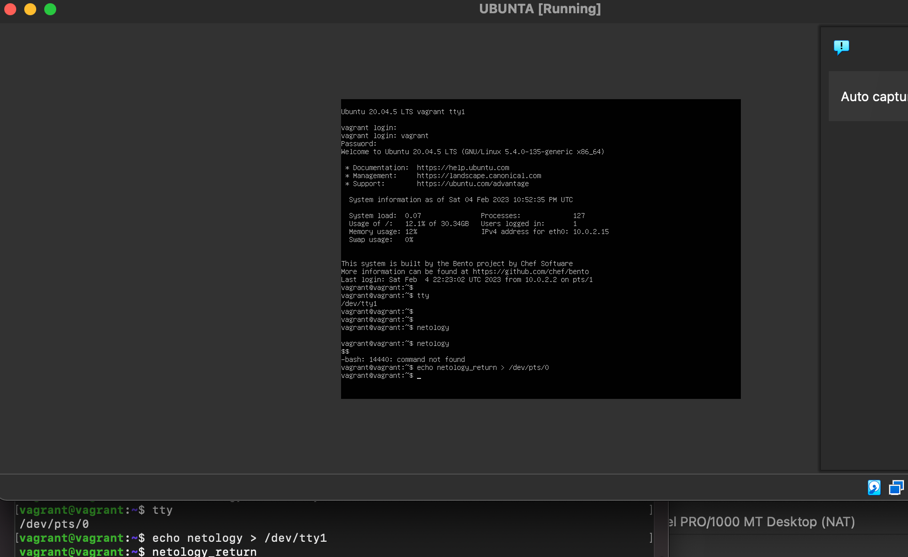
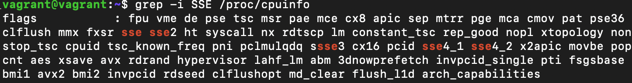

## Task 1
```bash
vagrant@vagrant:~$ type -a cd  
cd is a shell builtin
```
если бы не была встроенной, то при запуске из bash выполнялась бы в новом процессе и по факту не выполняла бы свою функцию перехода в нужную директорию  

## Task 2

grep -c <some_string> <some_file>

## Task 3
```bash
vagrant@vagrant:~$ ps p 1  
    PID TTY      STAT   TIME COMMAND  
      1 ?        Ss     0:03 /sbin/init

vagrant@vagrant:~$ lsof -p 1  
COMMAND PID USER   FD      TYPE DEVICE SIZE/OFF NODE NAME  
systemd   1 root  cwd   unknown                      /proc/1/cwd (readlink: Permission denied)  
systemd   1 root  rtd   unknown                      /proc/1/root (readlink: Permission denied)  
systemd   1 root  txt   unknown                      /proc/1/exe (readlink: Permission denied)  
systemd   1 root NOFD                                /proc/1/fd (opendir: Permission denied) 
````
## Task4
```bash
vagrant@vagrant:~$ tty  
/dev/pts/0  
vagrant@vagrant:$ ls 1 2>/dev/pts/1  
````
выводит в другую консоль ls: cannot access '1': No such file or directory

## Task 5
cat test > test1 - команда cat передаст свой вывод содержимого из файла test в новый файл test1

## Task 6
вывод в обе стороны видно на скрине, из PTY в TTY и обратно  


## Task 7
 
vagrant@vagrant:~$ bash 5>$1  
vagrant@vagrant:~$ echo netology > /proc/$$/fd/5  
netology  
дескриптор 5 перенаправлен в стандартный вывод, соответственно при ввод на дескриптор 5 переводит все в вывод  
```bash
vagrant@vagrant:~$ ls -lah /proc/$$/fd  
total 0  
dr-x------ 2 vagrant vagrant  0 Feb  4 21:56 .  
dr-xr-xr-x 9 vagrant vagrant  0 Feb  4 21:56 ..  
lrwx------ 1 vagrant vagrant 64 Feb  4 21:56 0 -> /dev/pts/0  
lrwx------ 1 vagrant vagrant 64 Feb  4 21:56 1 -> /dev/pts/0  
lrwx------ 1 vagrant vagrant 64 Feb  4 21:56 2 -> /dev/pts/0  
lrwx------ 1 vagrant vagrant 64 Feb  4 22:08 255 -> /dev/pts/0  
lrwx------ 1 vagrant vagrant 64 Feb  4 23:50 5 -> /dev/pts/0  
```
## Task 8
```bash
vagrant@vagrant:~/testpipe$ ls -lah   
total 8.0K  
drwxrwxr-x 2 vagrant vagrant 4.0K Feb  5 19:53 .  
drwxr-xr-x 5 vagrant vagrant 4.0K Feb  5 19:50 ..  
-rw-rw-r-- 1 vagrant vagrant    0 Feb  5 19:52 file1.txt  
-rw-rw-r-- 1 vagrant vagrant    0 Feb  5 19:52 file2.txt  
vagrant@vagrant:~/testpipe$ ls ./ testfile.txt 3>&1 1>&2 2>&3 | tee test.log  
ls: cannot access 'testfile.txt': No such file or directory  
./:  
file1.txt  file2.txt  test.log  
vagrant@vagrant:~/testpipe$ cat test.log   
ls: cannot access 'testfile.txt': No such file or directory  
```
сделал листинг текущей директории, получил ошибку на отсутствие файла testfile,
сохранил это сообщение в test.log  
обычный вывод ls текущей директории так же сохранился в stdout

## Task 9

`cat /proc/$$/environ` выводит переменные окружения текущего процесса  
так же эти данные можно получить через коменду `env`  

## Task 10
```bash
man proc  
-N  
&/proc\/\[pid\]\/cmdline  
&+ENTER  
:274 g  
-n  
```
 /proc/[pid]/cmdline  
              This read-only file holds the complete command line for the process,  un‐
              less  the  process  is a zombie.  In the latter case, there is nothing in
              this file: that is, a read on this file will return  0  characters.   The
              command-line  arguments appear in this file as a set of strings separated
              by null bytes ('\0'), with a further null byte after the last string.
 
/proc/[pid]/exe  
              Under Linux 2.2 and later, this file is a symbolic  link  containing  the
              actual  pathname  of  the  executed  command.   This symbolic link can be
              dereferenced normally; attempting to open it will  open  the  executable.
              You  can  even  type /proc/[pid]/exe to run another copy of the same exe‐
              cutable that is being run by process [pid].  If the pathname has been un‐
              linked, the symbolic link will contain the string '(deleted)' appended to
              the original pathname.  In a multithreaded process, the contents of  this
              symbolic link are not available if the main thread has already terminated
              (typically by calling pthread_exit(3)).

              Permission to dereference or read (readlink(2))  this  symbolic  link  is
              governed  by  a  ptrace  access  mode PTRACE_MODE_READ_FSCREDS check; see
              ptrace(2).

              Under Linux 2.0 and earlier, /proc/[pid]/exe is a pointer to  the  binary
              which  was  executed, and appears as a symbolic link.  A readlink(2) call
              on this file under Linux 2.0 returns a string in the format:

                  [device]:inode

              For example, [0301]:1502 would be inode 1502 on  device  major  03  (IDE,
              MFM, etc. drives) minor 01 (first partition on the first drive).

              find(1) with the -inum option can be used to locate the file.

## Task 11

grep -i SSE /proc/cpuinfo


старшая - это самая древняя или наоборот новая?
sse - древняя, sse4.2 - последняя

## Task 12

нужно добавить ключ -t  
```bash
vagrant@vagrant:~$ ssh -t localhost 'tty'  
vagrant@localhost's password:   
/dev/pts/1  
Connection to localhost closed.  
```

## Task 13

попробовал, с командой top нормально работает, но вот с командой sngrep наблюдаются сложности

к примеру `sngrep port 5060 -H udp:10.1.2.8:9060 -N -r -R &`  - это команда для мониторинга sip траффика и отправки hep пакетов на сервер  
в bg работает, делаю disown, перехожу в screen, делаю reptyr - получаю следующую картину  
root@ts1:/home/ingener# reptyr 12450  
[+] Allocated scratch page: b7730000  
[+] Looking up fds for tty in child.  
[+] Resolved child tty: 8803  
[+] Found an alias for the tty: 0  
[+] Found an alias for the tty: 1  
[+] Found an alias for the tty: 2  
[+] Opened the new tty in the child: 5  
[+] Target is not a session leader, attempting to setsid.  
[+] Forked a child: 12508  
[+] Change pgid for pid 12450  
[+] Did setsid()  
[+] Set the controlling tty  
`Dialog count: 305`  

`Dialog count: 305` - это вывод самой команды sngrep, т.е в целом она работает, перенеслась в screen, но нет возможности ей управлять и вообще ввести какие то комнды консольные

Сtrl-a d - нормально детачит окно и возвращается в родительскую консоль

## Task 14
Команда `echo` встроенная, соответственно выоплняется в том же процессе(bash) с теми же правами.  
Команда `tee` не встроенная, соответственно запускается в дочернем процессе, и если запускается из-под sudo, то с правами root, что позволяет ей изменять файлы в домашней папке root

