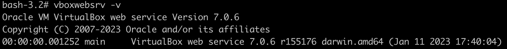
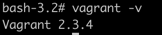
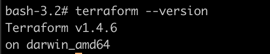

# Task 1
```
1. Ускорение производства и выпуск продукта на рынок
2. Стабильность среды, устранение дрейфа конфигураций
3. Более быстрая и эффективная разработка
```

Основополагающий принцип - идемпотентность, способность возвращать одинаковый результат при многократном использовании

# Task 2
Ansible - написан на python, нативный для Linux, не требует специальных агентов для развертывания,
работает по ssh, низкий порог входа

# Task 3
1. 
2. 
3. 

