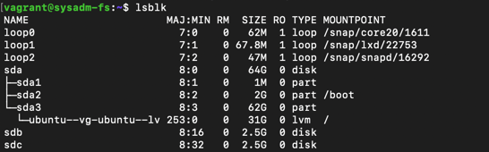
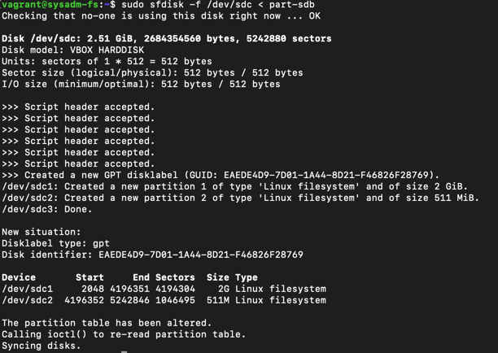
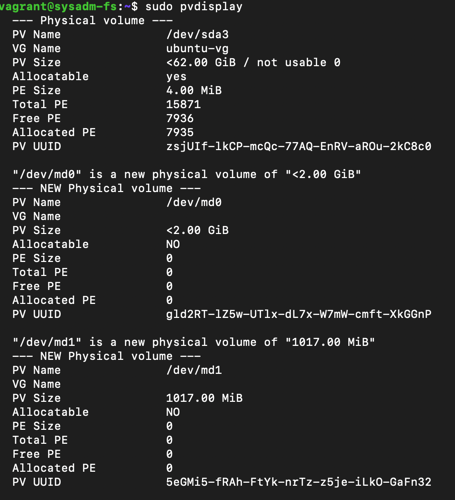
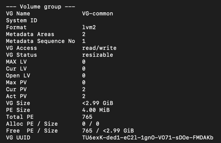
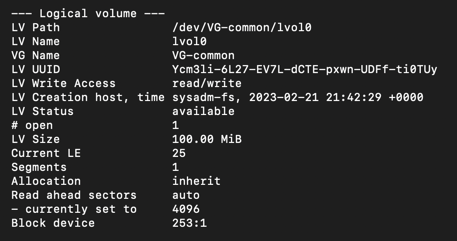
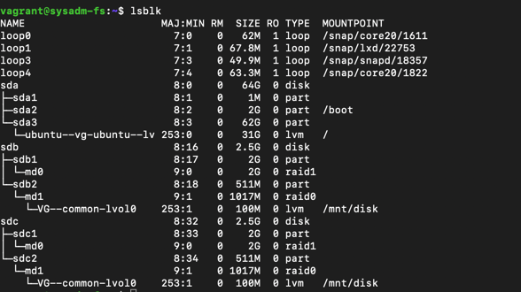
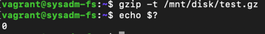
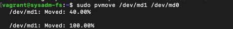
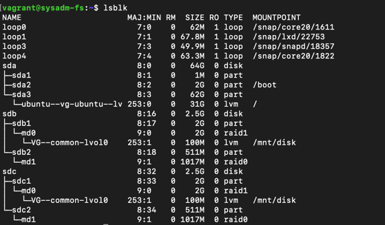
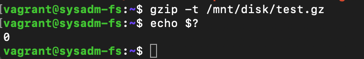

## Task 1
sparse файлы - файлы, в которых свободное место (нулевые байты) заменены на информацию о последовательности этих байтов(дырах)

экономит место, но имеет свои ограничения
## Task 2
Жесткие ссылки ссылаются на одну inode и имеют один набор разрешений, что и у исходного файла,
поэтому разные разрешения установить не удастся

## Task 3

## Task 4

## Task 5
```
sudo sfdisk -d /dev/sdb > part-sdb
sudo sfdisk -f /dev/sdc < part-sdb
```


## Task 6-16
```
sudo mdadm --create -l1  /dev/md0 -n2 /dev/sdb1 /dev/sdc1
sudo mdadm --create -l0  /dev/md1 -n2 /dev/sdb2 /dev/sdc2
sudo pvcreate -v /dev/md0
sudo pvcreate -v /dev/md1
sudo vgcreate -v VG-common /dev/md0 /dev/md1
sudo lvcreate -L 100M VG-common /dev/md1
sudo mkfs.ext4  /dev/VG-common/lvol0
sudo mkdir /mnt/disk
sudo mount /dev/VG-common/lvol0 /mnt/disk
sudo pvmove /dev/md1 /dev/md0
```








## Task 17-18
```
vagrant@sysadm-fs:~$ sudo mdadm /dev/md0 --fail /dev/sdb1
mdadm: set /dev/sdb1 faulty in /dev/md0
```

## Task 19
